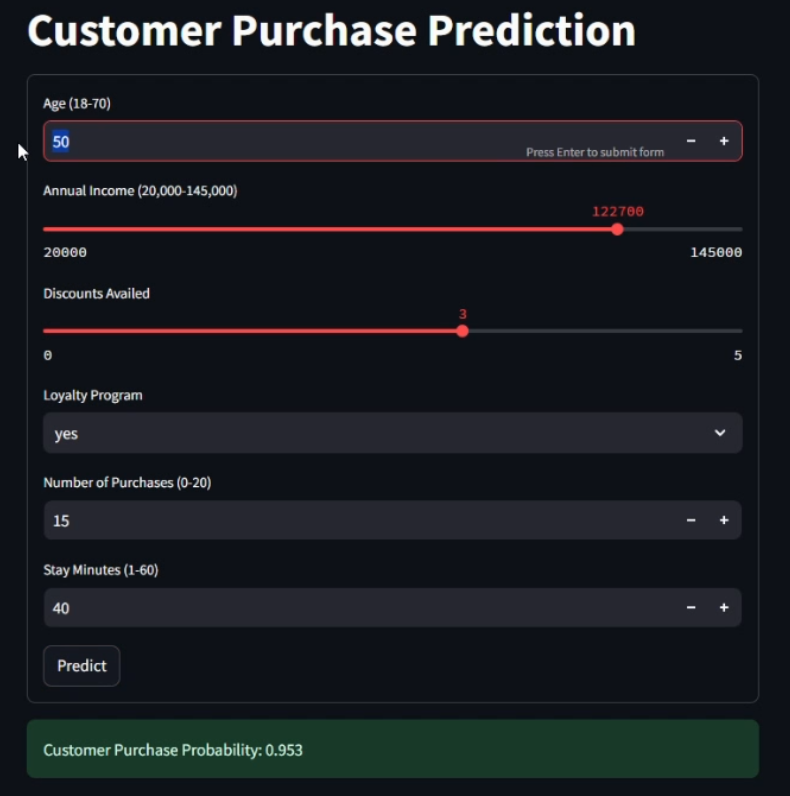

# ML-Zoomcamp Mid-Project

## Customer Purchase Prediction

### Overview
This project is designed to predict the likelihood of a customer making a purchase based on demographic and behavioral features. It incorporates data preprocessing, exploratory data analysis (EDA), model training, and deployment through a web interface using Streamlit.

The model utilizes a **Random Forest Classifier** to predict purchase probabilities. The project includes local deployment using Docker, with bonus deployment steps for cloud environments.

---

### Features

**Input Features:**
- Age
- Annual Income
- Discounts Availed
- Loyalty Program Status
- Number of Purchases
- Time Spent on Website

**Output:**
- Predicted probability of purchase (a value between 0 and 1).

---

### Project Structure
The project includes the following files:

- **`notebook.py`**:
  - Data preparation and cleaning
  - Exploratory Data Analysis (EDA)
  - Model training and hyperparameter tuning

- **`train.py`**:
  - Training the Random Forest Classifier
  - Saving the trained model using `pickle`

- **`predict.py`**:
  - Loading the model
  - Function to predict customer purchase probabilities

- **`app.py`**:
  - Streamlit-based web application

- **`Dockerfile`**:
  - Instructions for containerizing the application

- **`requirements.txt`**:
  - List of dependencies for the project

- **Dataset**:
  - A CSV file containing the customer dataset (instructions provided to download it if not included).

---

### Prerequisites
- **Python** (version >= 3.8)
- Required Python packages (specified in `requirements.txt`)
- **Docker** (for containerization)
- Dataset available from **[Kaggle: Predict Customer Purchase Behavior Dataset](https://www.kaggle.com/datasets/rabieelkharoua/predict-customer-purchase-behavior-dataset)**.

---

### Setup and Execution

#### Step 1: Clone the Repository
```bash
git clone https://github.com/your-repository-url/customer-purchase-prediction.git
cd customer-purchase-prediction
```

#### Step 2: Install Dependencies
Create a virtual environment and install dependencies:

```bash
python -m venv venv
source venv/bin/activate # For Linux/Mac
venv\Scripts\activate    # For Windows
pip install -r requirements.txt
```

Run the App Locally
```bash
streamlit run app.py
```

## Using Docker
Step 1: Build the Docker Image
```bash
docker build -t customer-purchase-prediction .
Step 2: Run the Docker Container
```bash
docker run -p 8501:8501 customer-purchase-prediction
```

## Project Deliverables
- A Streamlit application for customer purchase prediction.
- Docker container for easy deployment.
- Dataset analysis and preprocessing script in notebook.py.
- Trained model and prediction scripts.

## Web Interface


## Evaluation
| **Criterion**             | **Description**                                                                                     |
|---------------------------|-----------------------------------------------------------------------------------------------------|
| **Data Preprocessing and Exploration** | Dataset cleaned and preprocessed with no missing values. EDA performed to derive insights and prepare features. |
| **Model Training and Validation**      | Random Forest Classifier implemented and tuned for optimal performance. Metrics validated on a test set.           |
| **Script Organization**               | Project modularized into `notebook.py`, `train.py`, `predict.py`, and `app.py` for clarity and maintainability.   |
| **Application Deployment**            | Streamlit app deployed locally and containerized using Docker for consistent deployment across environments.       |
| **Documentation**                     | Detailed README provided with setup instructions, usage steps, and screenshots of the app interface.              |
| **Code Quality**                      | Scripts well-commented, following Python coding standards for readability and maintainability.                    |
| **Reproducibility**                   | Dependencies listed in `requirements.txt`, with Docker ensuring application reproducibility.                      |
| **User Interaction**                  | Interactive Streamlit app where users can input data and view purchase probability predictions dynamically.       |

## Acknowledgements
- Dataset: Kaggle: Predict Customer Purchase Behavior Dataset​.
- Libraries: pandas, numpy, scikit-learn, streamlit, pickle.
